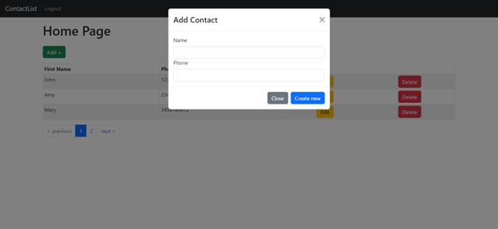

# ContactList

- [Backend deployment domain](https://contactlist-production-c316.up.railway.app/)
- [Front deployment domain](https://contactlist-web-production.up.railway.app/login)

</br>

 
        


</br>



A user-managed sample `Single Page Application` (SPA) made by ReactJS (frontend) and `NestJS/TypeScript` (backend) that lets you log-in using the registered credentials, view/add/update/delete the contacts in a responsive paginated table, stored in a remote `MongoDB` database.
<br/>
The application's backend is supported through a self-designed database system hosted remotely on `MongoDB Atlas`, with the data being fetched through `RESTful API` calls made by `Axios`.
</br></br>

## Features
 - Users can register and login using their desired EMail IDs and passwords. Passwords are encrypted throughn the `Passport` library for hashing the data before storing in the database for higher security.
 - The landing page and each subsequent route features a relatively simple and user-friendly UI designed and supported through `CSS/SCSS and Bootstrap`.
 - Exploits `RESTful API` supported through MongoDB Atlas, managed by `NestJS franework`, build entirely with `Typescript`.
 - The website acts as a `Single Page Application` (SPA), exploiting `ReactJS` for designing the frontend, providing the users with multiple routes for Login/Registration, Home and adding states.
 - Implemented `JSON Web Token` for user authorization and session storage. Users get a JWT upon successful login/registration (which is stored locally), used to protect the sensitive actions through a self-defined `JWT Strategy`.

</br>

# Running the Application

</br>

1. Pull down the code from `master` branch locally
2. Open the project in your preferred IDE.
3. The cloned branch opens to the root directory for the application, containing multiple sub-directories for the backend (`serer`) and frontend (`web`) respectively.
4. ## Setting up the Backend Server
    - Open a new terminal at root and navigate to the backend dir using the following command.
    ```
    cd server
    ```
    - Install the npm modules required by the application using:
    ```
    npm install
    ```
    - Start the backend server using the following npm script
    ```
    npm run start:dev
    ```
    > NOTE: This starts the backend server on port 3000. You can change the setting in the `main.ts` file [here](server\src\main.ts)

<br/>

5. ## Setting up the Frontend Server
    - Open a new terminal and navigate to the frontend directory using:
    ```
    cd web
    ```
    - Install the npm modules using the following commands before running the server
    ```
    npm i
    ```
    - Start the frontend server using the following npm script
    ```
    npm run dev
    ```
    > NOTE: This starts the frontend server on port 8000. You can change the setting in the `package.json` file [here](web\package.json)
    4. (Optional) Make the following changes to start the server on other PORT.
    ```
    {
    ... ,
    "scripts": {
        "start": "set PORT=<PORT_VALUE> && react-scripts start",
        ...
    }

    ```

</br>
